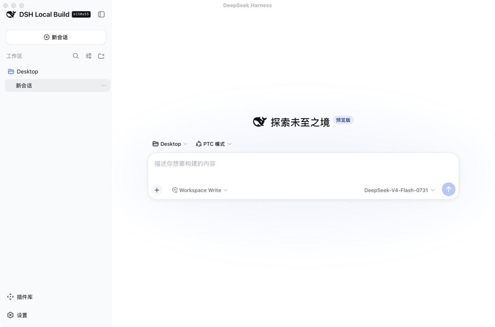
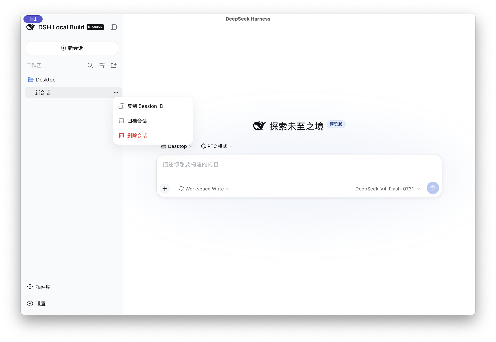
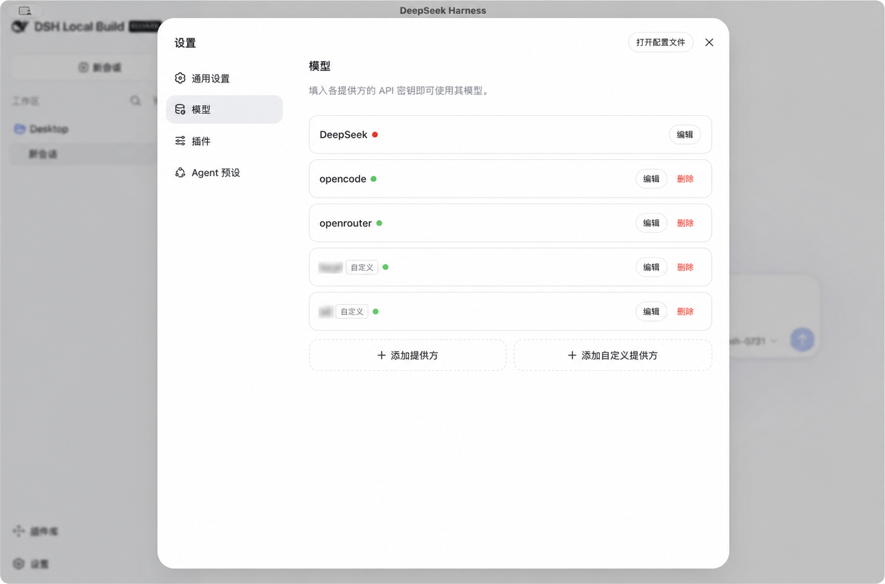
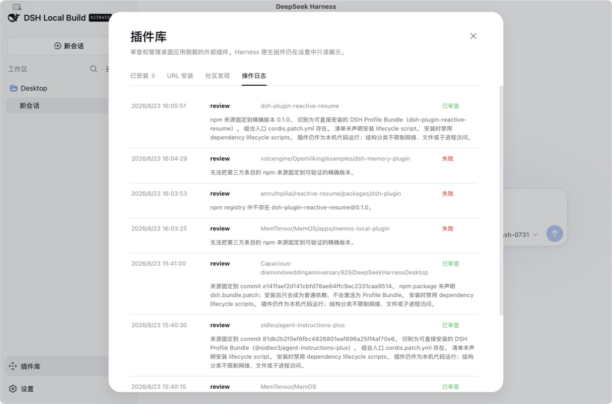

# DeepSeek Harness Desktop for macOS

English | [中文](README.zh.md)

DeepSeek Harness Desktop packages the complete upstream `dsh web` experience as a native macOS application. It keeps the Harness runtime, profiles, Cordis composition, and source layout intact while adding desktop lifecycle management, session continuity, native keyboard shortcuts, source updates, and an isolated review flow for sideloaded plugins.

<p align="center"></p>



> This is a local developer-preview build. It is ad-hoc signed, is not distributed through the Mac App Store, and may require rebuilding when upstream Harness changes.

## What the desktop application adds

- **Native application lifecycle.** A Swift shell starts the repository-built `dsh web` runtime on an operating-system-selected loopback port, waits for a successful health check, and embeds it in WKWebView without opening a browser tab. The integrated transparent title bar preserves a native drag region over the main content's blank top area without covering sidebar controls.
- **Desktop session behavior.** The selected session survives an application restart. Session menus add Copy Session ID, Archive, and Delete, while the native Edit menu forwards undo, redo, cut, copy, paste, and select-all to the focused Web control.
- **Source update and rollback.** Updates build and health-check a detached Git worktree before switching the active source. The current checkout is never merged, reset, or overwritten, and the previous source pointer remains available for rollback.
- **Model-provider usability fixes.** Provider configuration supports custom OpenAI-compatible endpoints, including local `/v1` services. Model menus constrain long names with ellipsis and avoid horizontal scrolling.
- **Plugin library.** A desktop-only sidebar entry shows the built-in Bundles, discovers community projects, performs local structure and safety review, pins immutable sources, and records installation activity. Other Harness-native components remain in Settings.
- **Native attachment picker.** The “Files and folders” action opens one Finder panel directly; the panel accepts ordinary files and directories without an intermediate Web dialog.
- **Responsive desktop presentation.** The application preserves the upstream interface and adds a fixed, resolution-aware plugin-library canvas rather than redesigning the existing sidebar or settings pages.

## Built-in plugins

The default macOS application includes these components without a separate installation step:

- **Plugin library.** The `@deepseek-ai/dsh-client-ui-plugin-library` desktop surface provides installed-plugin inventory, URL review, community discovery, and the audit log. It is an application component rather than a removable profile Bundle.
- **Deepseek-Files.** The default [`@deepseek-ai/dsh-file-recognizer-office`](packages/attachment/file-recognizer-office/README.md) Bundle accepts files and folders, extracts supported text, Markdown, tabular, Office, OpenDocument, and PDF content locally, and can use configured OCR, audio-transcription, or video-understanding fallbacks when native model input is unavailable.
- **Model Capabilities.** The default [`@deepseek-ai/dsh-model-catalog`](packages/llm/model-catalog/README.md) Bundle refreshes exact input-modality declarations from `models.dev`, retains a last-good snapshot, and falls back to pi-ai's installed catalog. It never guesses capabilities from a model name or protocol.

Existing Web profiles with the shipped application prefix receive missing built-in Bundles on the next launch while preserving third-party Bundle entries.

## Desktop changes in the GUI

The screenshots below focus on behavior added by this desktop package rather than repeating the upstream Harness interface.

### Session actions and restoration



The session menu exposes the three desktop-requested actions. Reopening the application restores the previously selected session instead of creating and selecting an empty session on every launch.

### Custom model providers



Custom provider names are redacted in this documentation screenshot. Public provider and model names can remain visible, but private provider labels, Base URLs, and API keys should never be committed to documentation.

### Community discovery


Community discovery is separate from URL installation. GitHub's [`dsh-plugin` topic](https://github.com/topics/dsh-plugin) and [deepseek1024.com](https://deepseek1024.com/) are independent, untrusted catalogs with their own search, filters, pagination state, and 15-minute cache. Catalog presence is only a discovery signal and never grants installation permission.

### URL review and compatibility classification


URL review accepts an exact npm version or an HTTPS GitHub repository pinned to a commit hash. The reviewer assigns one of four outcomes:

- **Direct install:** the package has a root manifest, declares `dsh.bundle.patch`, and references an existing package-internal YAML composition entry.
- **Needs adaptation:** the repository is related to Harness but does not satisfy the installable DSH Bundle structure.
- **External project:** the source is an application, service, library, or other project rather than a Harness plugin bundle.
- **Blocked:** the source is mutable, malformed, unsafe to inspect, or fails a required security check.

Only Direct install produces a single-use native review token. An npm release whose `dependencies`, `optionalDependencies`, or `peerDependencies` retain `workspace:` specifiers remains structurally eligible, but the reviewer lists every affected runtime dependency and requires the user to choose Force install or Cancel. Cancel immediately revokes the token. Force install passes the unchanged package to pnpm, so pnpm may still reject an invalid release; the desktop app never rewrites a third-party package to make it installable. Every token expires after 15 minutes, and installation keeps dependency lifecycle scripts disabled.

### Audit records



Review, installation, update, removal, and failure results are appended to `logs/plugin-audit.jsonl` under the application's support directory. The log records the source, classification, action, status, timestamp, and diagnostic message without storing credentials.

<a id="run"></a><a id="run-from-source"></a>

## Build and run

Requirements are macOS 13 or newer, Swift 6, Node.js `^22.19.0 || >=24.0.0`, Git, `rsvg-convert` from librsvg, and network access for the first dependency installation. From the repository root:

```sh
npx --yes pnpm@11.7.0 install --frozen-lockfile
npx --yes pnpm@11.7.0 run build
desktop-shell/scripts/build-app.sh
open "desktop-shell/dist/DeepSeek Harness.app"
```

The build script recreates `desktop-shell/dist/DeepSeek Harness.app`, generates `AppIcon.icns`, applies an ad-hoc signature after all resources are present, and records the current checkout as the initial source root. If that path is unavailable on another Mac, the application clones the upstream `master` branch into Application Support and builds it before first launch.

To replace an older installed build, quit DeepSeek Harness and copy the newly built application to `/Applications/DeepSeek Harness.app`. A sibling path ending in `.previous` is a recoverable backup of the replaced application, not Harness user data.

To create a shareable disk image from the current worktree:

```sh
desktop-shell/scripts/package-dmg.sh
```

The distribution build removes the developer checkout path and embeds a source snapshot assembled only from tracked and non-ignored worktree files. It does not include Application Support data, profiles, API keys, sessions, logs, ignored `.env` files, or package caches. The resulting `desktop-shell/dist/DeepSeek-Harness-macOS.dmg` remains ad-hoc signed and is not notarized, so macOS may require an explicit first-open approval.

On first launch, the distributed application uses an existing `node` and `npx` when they satisfy `^22.19.0 || >=24.0.0`. Otherwise it downloads the official Node.js 24.16.0 ARM64 archive, verifies its pinned SHA-256 digest, and installs it under the application support directory without administrator access or changes to the system Node.js installation. The initial pnpm dependency installation still requires network access.

## Data, logs, and source versions

Sessions, settings, credentials, profiles, plugin dependencies, and desktop logs live under:

```text
~/Library/Application Support/DeepSeek Harness Desktop/
```

Harness data is stored in its `data` subdirectory and remains separate from both the application bundle and source worktrees. Source updates and rollback therefore retain the same sessions and settings. A rollback switches the source pointer only; it cannot reverse an upstream migration of persisted data.

The runtime is the repository's built `apps/cli/lib/bin.js`, launched with `--no-open --port 0`. Startup requires both the readiness URL printed by `dsh web` and a successful HTTP request. Runtime warnings remain available in the desktop log instead of replacing the startup screen.

## Plugin installation and trust

The standard Plugin menu delegates add, update, remove, and list operations to the official `dsh plugin --profile web` command. The desktop plugin library adds review and discovery, then delegates approved installation and removal to the same command using the repository-pinned pnpm version.

Third-party plugins execute as trusted local code. Agent file operations may use the Harness sandbox, but that does not automatically confine plugin processes, configured MCP servers, network access, or host process visibility. Review every source and treat a plugin update as a code update.

## Security limits

The Web UI listens only on `127.0.0.1`, and external links open in the default browser rather than replacing the application view. On macOS, Harness uses Seatbelt for supported agent file effects, with the default Web permission preset beginning at `workspace-write`.

The desktop application itself does not enable the macOS App Sandbox because it must launch Node.js, Git, the package manager, and agent subprocesses and must access user-selected workspaces. Docker is not enabled by default. A future container backend can provide an additional opt-in isolation layer with explicit workspace mounts, persistent Harness data, a random loopback port, and no Docker socket mount.
